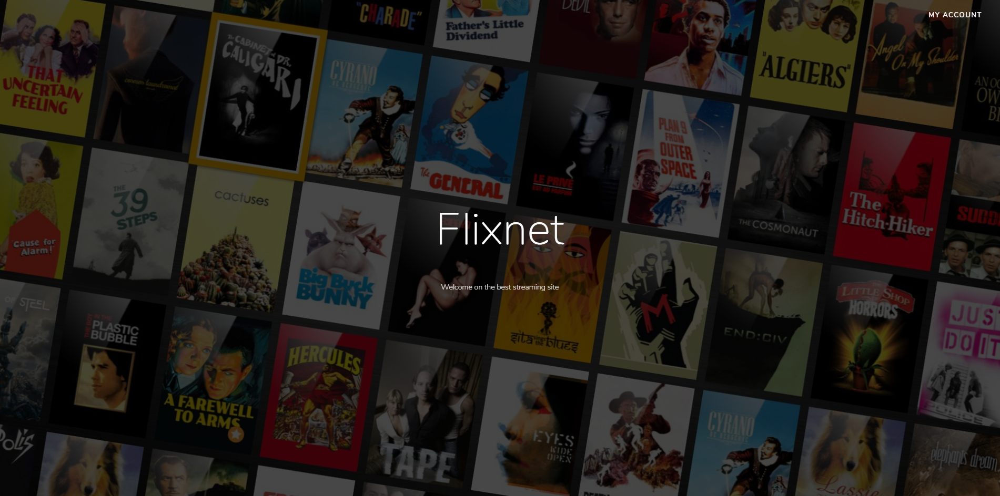
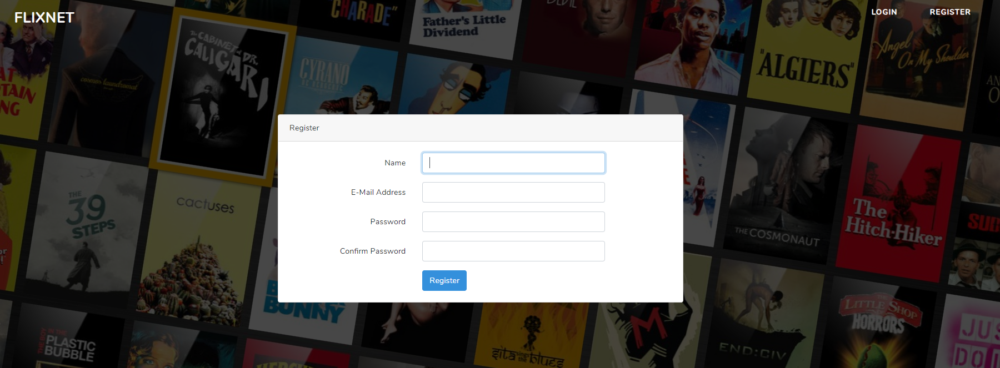
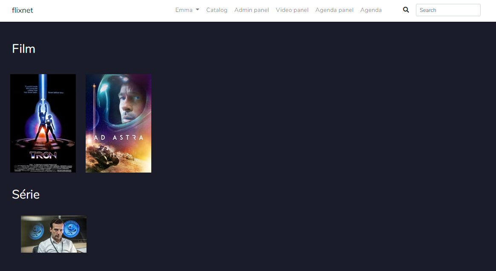
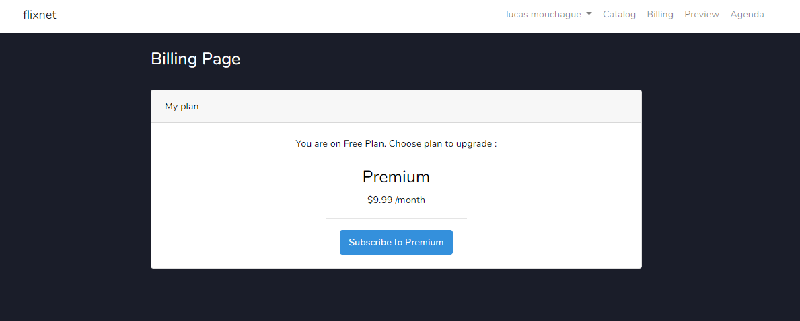
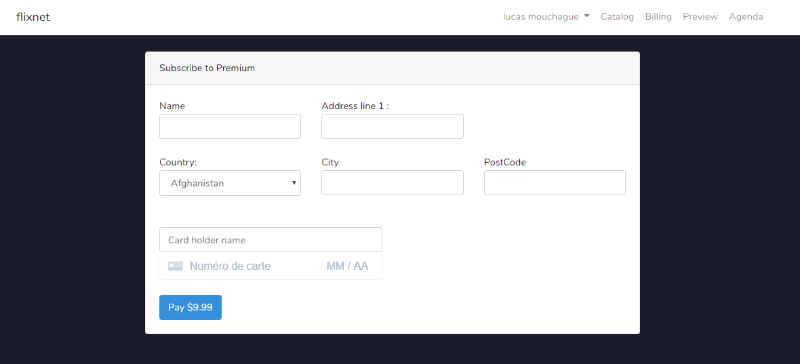
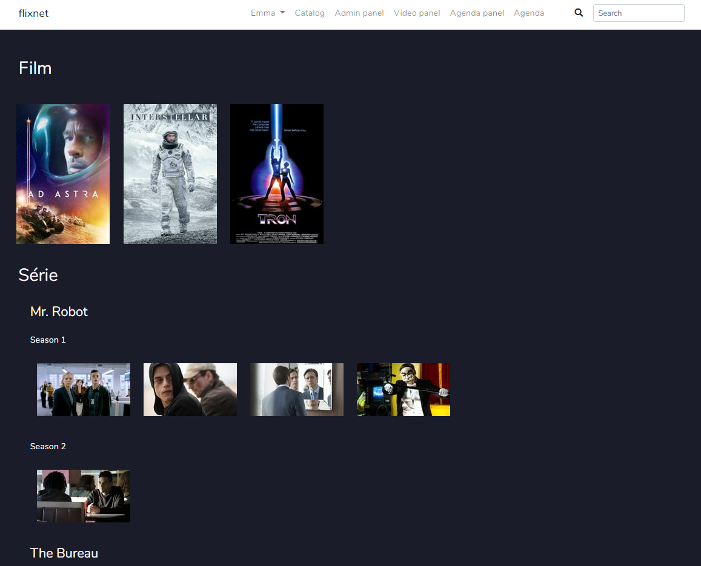

# Site Streaming
## Installation
### Requirements
Pour installer ce projet vous devez installer :
```
npm
composer
php
```
Vous devez aussi ajouter un fichier .env a la racine du projet voici un exemple :
```
APP_NAME="Flixnet"
APP_ENV=local
APP_KEY=base64:t8CZOyRPZfRlFiYYnf2wbYYCxTqlTZd7JlnaiQow6v8=
APP_DEBUG=true
APP_URL=http://192.168.1.100:8000

LOG_CHANNEL=stack

DB_CONNECTION=mysql
DB_HOST=127.0.0.1
DB_PORT=3306
DB_DATABASE=[[ Name of your database ]]
DB_USERNAME=[[ User of you database ]]
DB_PASSWORD=[[ Password of your user ]]

BROADCAST_DRIVER=log
CACHE_DRIVER=file
QUEUE_CONNECTION=sync
SESSION_DRIVER=file
SESSION_LIFETIME=120

REDIS_HOST=127.0.0.1
REDIS_PASSWORD=null
REDIS_PORT=6379

MAIL_DRIVER=smtp
MAIL_HOST=smtp.gmail.com
MAIL_PORT=465
MAIL_USERNAME=[[ Gmail email address ]]
MAIL_PASSWORD=[[ Password of you email address ]]
MAIL_ENCRYPTION=ssl
MAIL_FROM_ADDRESS=null
MAIL_FROM_NAME="${APP_NAME}"

AWS_ACCESS_KEY_ID=
AWS_SECRET_ACCESS_KEY=
AWS_DEFAULT_REGION=us-east-1
AWS_BUCKET=

PUSHER_APP_ID=
PUSHER_APP_KEY=
PUSHER_APP_SECRET=
PUSHER_APP_CLUSTER=mt1

MIX_PUSHER_APP_KEY="${PUSHER_APP_KEY}"
MIX_PUSHER_APP_CLUSTER="${PUSHER_APP_CLUSTER}"

STRIPE_KEY=[[ Stripe key ]]
STRIPE_SECRET=[[ Stripe secret key ]]
```
Après vous pouvez installer le projet :
```
composer install
php artisan migrate:fresh
php artisan db:seed
php artisan storage:link
php artisan cache:clear
php artisan config:clear
php artisan view:clear
npm run dev
php artisan serve
```
Et voila vous pouvez acceder a la plateforme a l'adresse suivante : ```127.0.0.1:8000```
## Architecture du site
### Pour un utilisateur premium
```
Home
-- Login
--- Forgotten password
--- Catalog (with all movies and series)
---- Player
--- My account
---- Edit
--- Billing
---- Add Payment method
---- Cancel plan
--- Invoices
--- Agenda
--- Logout
```
### Pour un utilisateur gratuit
```
Home
-- Login
--- Forgotten password
--- Catalog (with 2 random movies and 1 random tv show episode per day)
---- Player
--- My account
---- Edit
--- Billing
---- Add Payment method
---- Cancel plan
--- Invoices
--- Agenda
--- Logout
```
### Pour un utilisateur admin
```
Home
-- Login
--- Forgotten password
--- Catalog (with all movies and series)
---- Player
--- My account
---- Edit
--- Admin panel
---- Create user
---- Edit
---- Delete
--- Video panel
---- Create content
---- Edit
---- Delete
--- Agenda panel
---- Create agenda
--- Agenda
```
## Architecture de la base de données

## Fonctionnalités majeures
### Paiements par mois
### Stream vidéo
Utilisation du player plyr
### Upload de vidéo et de série
### Détection automatique des métadata d'une vidéo
Grace au nom d'une vidéo nous arrivons automatiquement récuperer ses informations (Synopsis, note, date de sortie, etc...
### Catalogue gratuit de contenu
Toute les 24 heures le catalogue de vidéo pour les utilisateurs gratuit s'actualise
## Capture d'écrans

---

---

---

---

---

---

